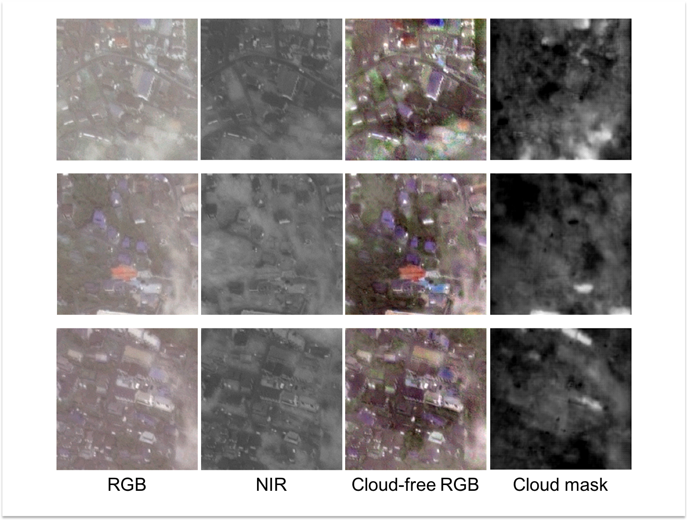

# Multispectral conditional Generative Adversarial Nets
This repository is an implementation of ["Filmy Cloud Removal on Satellite Imagery with Multispectral Conditional Generative Adversarial Nets"](https://arxiv.org/abs/1710.04835).



## Requirements
I recommend Anaconda to manage your Python libraries.  
Because it is easy to install some of the libraries necessary to prepare the data.  

* Python3 (tested with 3.5.4)
* PyTorch (tested with 0.4.1)
* TorchVision (tested with 0.2.1)
* Numpy (tested with 1.14.2)
* OpenCV (tested with 3.3.1)
* Pillow (tested with 5.0.0)
* tqdm (tested with 4.15.0)
* PyYAML (tested with 3.12)

## Preparing the data
Please refer to [make_dataset/README.md](make_dataset/README.md).

## How to train
You need set each parameters in `config.yml`.  
When you run `train.py`, `config.yml` is automatically copied to a directory `out_dir` defined at `config.yml`.  

```bash
python train.py
```

## How to test

```bash
python predict.py --config <path_to_config.yml_in_the_out_dir> --test_dir <path_to_a_directory_stored_test_data> --out_dir <path_to_an_output_directory> --pretrained <path_to_a_pretrained_model> --cuda
```

## Pre-trained model
You can download a pre-trained model from [here](https://drive.google.com/open?id=1_EooDDOxkHoZ5YvUhcxutvVBCcH4FYNI).
